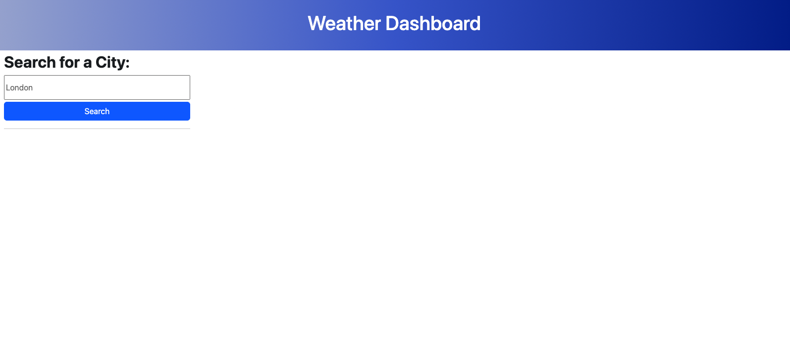
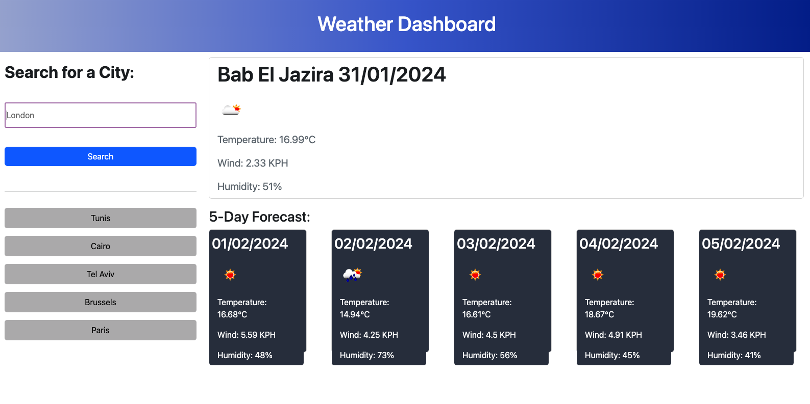

# Weather-Dashboard

## Description

This is a weather dashboard app that shows the current weather and a 5-day forecast for any city. Enter a city in the input field and click search for detailed information about the weather. The Weather section shows the current weather, and the five-day forecast is in five different tabs. The left side displays a history of validated cities, up to a maximum of five.

Link to the deployed project:
https://unicorn453.github.io/Weather-Dashboard/

When opened the page should look like this:

When the search button is clicked with a city in the input field the page should look like this:

## Installation

N/A

## Usage

**Note: The weather forecast is _only rendered_ when the input field is filled and the button is clicked.**
To use the app, simply enter the name of the city you want to check in the input field and click on the search button. This will provide you with detailed information about the city, including the current weather icon, date and additional details about the temperature, humidity and wind.

In addition to this, the app also displays a five-day forecast for the city. Each day's weather information is displayed in a separate tab, with only the date shown at the top.

To the left of the search button, you will find a history of up to five previously searched cities, which will be displayed once the city has been validated. You can then click on any saved history button and obtain the data again.

## Credits

The development of the code process involved leveraging ChatGPT.
Other resources:
I used a previously written README file as a template to create this README.
‌

## License

Please refer to the LICENSE in the repo.
